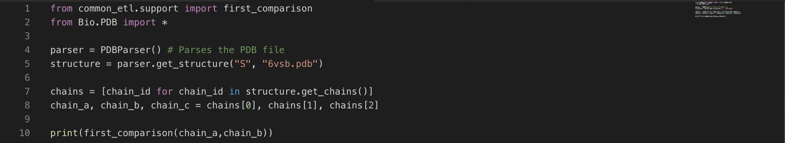
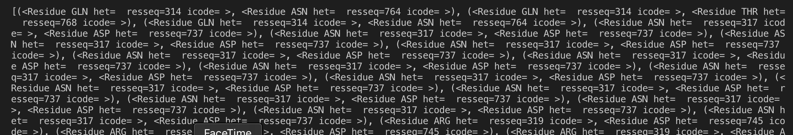
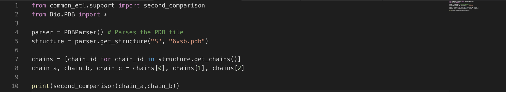
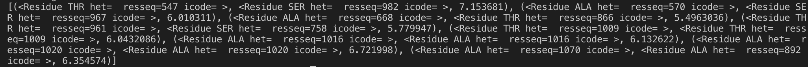
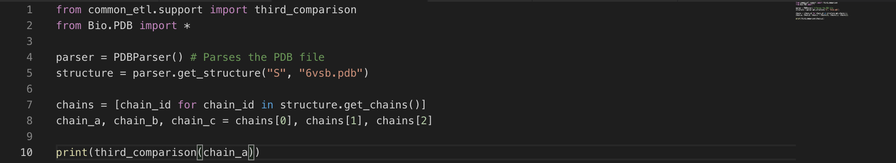
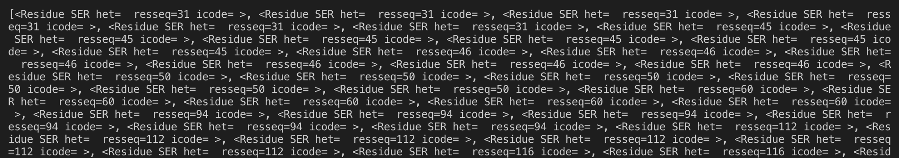
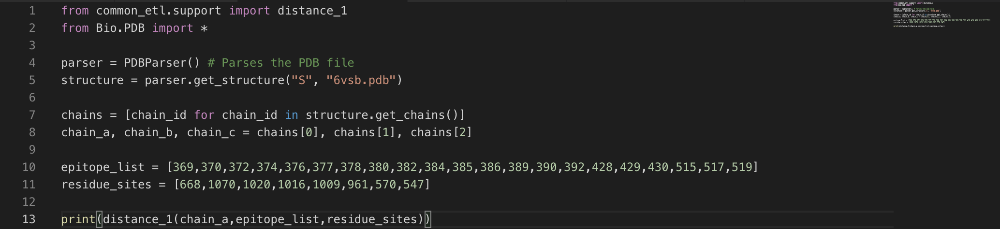
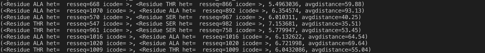

This page gives an overview of all PDBTools objects,fuctions and methods. All classes and functions exposed in *PDBTools*. 

PDBTools has its own functions to start computations,compare, and analyze data. These general PDBTool functions are described below:

| Function | Description |
| ----------- | ----------- |
| first_comparison(*args, **kwargs) | Compare two amino acid chains |
| second_comparison(*args, **kwargs) | Compare two amino acid chains based on the types of amino acids |
|third_comparison(*args, **kwargs)| Locates the selected amino acid |
|distance_1 (*args, **kwargs)      | Calculates the distance from one specific amino acid to the substitution site |
|distance_2(*args, **kwargs) | Calculates the disance from an amino acid site to a range of substitution sites |
|filter_results(*args) | Filters the results returned after the amino acids have been compared. |

<strong>first_comparison</strong>(*args, **kwargs)

Compare two amino acid Chains 

<strong>Parameters:</strong> args:object

Data that contains an iterable or list-like objects

kwargs 

Extra keywords to forward to the scheduler function
 

### Examples 

    
 
    
<strong>second_comparison</strong>(*args, **kwargs)

Compare two amino acid chains based on the types of amino acids  

<strong>Parameters:</strong>  args:object

Data that contains an iterable or list-like objects

kwargs 

Extra keywords to forward to the scheduler function

### Examples 

 

<strong>third_comparison</strong>(*args, **kwargs)

Locates the selected amino acid 

<strong>Parameters</strong>:  args:object

Data that contains an iterable or list-like objects

kwargs 

Extra keywords to forward to the scheduler function

### Examples 

 

<strong>distance_1</strong>(*args, **kwargs)

Calculates the distance from one specific amino acid to the substitution site

<strong>Parameters:</strong>  args:object

Data that contains an iterable or list-like objects

kwargs 

Extra keywords to forward to the scheduler function

### Examples 

 

<strong>distance_2</strong>(*args, **kwargs)

Calculates the disance from an amino acid site to a range of substitution site

<strong>Parameters:</strong>  args:object

Data that contains an iterable or list-like objects

kwargs 

Extra keywords to forward to the scheduler function

### Examples

<strong>filter_results</strong>(*args)

Filters the results returned after the amino acids have been compared 

<strong>Parameters:</strong>  args:object

Data that contains an iterable or list-like objects

### Examples

